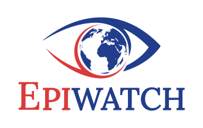

<!--
SPDX-FileCopyrightText: 2023 University of New South Wales <copyright@unsw.edu.au>
SPDX-License-Identifier: Apache-2.0
-->

<a name="readme-top"></a>

<br />
<div align="center">
  <a href="https://github.com/epiwatch/ews-dashboard/">
    
  </a>

<h3 align="center">EPIWATCH™️ Open Public Dashboard</h3>

  <p align="center">
    EPIWATCH™️ is an artificial intelligence-driven open-source outbreak observatory for early outbreak warnings (including infectious disease epidemics) and rapid risk analysis.
    <br />
    <br />
    Supported by the Balvi Filanthropic Fund's Shiba Inu Initiative, we'll be progressively open sourcing much of the codebase, starting with an <em>EPIWATCH Open Dashboard</em> project here. This code will be based on the <a href="https://www.epiwatch.org/reports">EPIWATCH Public Dashboard</a> (a managed service operated by the EPIWATCH Team at UNSW's Biosecurity Program).
    <br />
    <br />
  </p>
  <p>
    Copyright&copy; University of New South Wales.<br/><a href="https://www.epiwatch.org/">EPIWATCH&reg;</a> is a registered trademark of <a href="https://www.unsw.edu.au/">UNSW</a>.
  </p>
</div>


## Quick Links

* [Request Feature](https://github.com/epiwatch/ews-dashboard/issues)
* [Report Bugs](https://github.com/epiwatch/ews-dashboard/issues)
* [Report Security Issues](SECURITY.md)

<p align="right">(<a href="#readme-top">back to top</a>)</p>


<!-- ABOUT THE PROJECT -->
## About

EPIWATCH is the leading platform for rapid detection of emerging diseases signals from open source intelligence sources. The concept emerged in the wake of the 2015 West African Ebola epidemic, which demonstrated a critical gap in global capabilities for the early detection of emerging pandemics. EPIWATCH applies multiple AI technologies to fill this gap and enable rapid responses to exponential health threats, to prevent them from becoming widespread outbreaks and pandemics.

The EPIWATCH product has emerged from a research project at UNSW, led by Professor <a href="https://research.unsw.edu.au/people/professor-raina-macintyre">Raina MacIntyre</a> (Head of Biosecurity), a Eureka Award winner for her scientific leadership. In 2022, EPIWATCH received a significant donation from Vitalik Buterin's Balvi Filanthropic Fund. In 2022, the project won <a href="https://www.innovationaus.com/videos/innovationaus-awards-2022-highlights/">InnovationAus 2022 People's Choice Award</a>.

The code in this current open source repository (initially a report and statistics viewer component and part of the public front-end), is our first public step towards building an open-source development community around detection of emerging infectious diseases of high consequence. We hope you'll join us in helping to build a healthier world.


<p align="right">(<a href="#readme-top">back to top</a>)</p>


## Features

This open dashboard project, is a web application user interface (UI) that allows querying of an EPIWATCH Reports database. EPIWATCH Reports are structured information about open-source intelligence (OSINT) signals, e.g. highlighting a news media article about a potential infectious outbreak.

Queries on the Report data can be made by publication date range, disease names or syndrome names, locations, or keywords, with results presented in a table for the user to view (e.g. with links out to the relevant original source articles).

This UI is implemented as a front-end web application (mostly written in client-side Typescript, using NextJS framework, and runs in the browser), and connects to a web-based Dashboard API service. An example of a simplified API using sample data is provided for development purposes, and should an external API service be unavailable.


<p align="right">(<a href="#readme-top">back to top</a>)</p>

## Installing / Getting Started

### Prerequisites

EPIWATCH is developed on latest Ubuntu and Fedora Linux LTS distributions, however it should work on other operating systems.

It requires the following to be pre-installed:

- NodeJS (latest LTS version, e.g. >=v18.15.0).
- Yarn (latest LTS version, e.g. >=v3.5.0).

### Install

Checkout this project (or download and unpack the zip), then:

```sh
    yarn install
```

### Configure
Update properties in the local configuration file if required.

```sh
    vim .env.development
```

If you've been provided access to an EPIWATCH API server instance, you can modify ```NEXT_PUBLIC_API_URL``` to point at the URL. By default, it will start on http://localhost:3000/, however if 3000 is already in use, NodeJS will automatically use the next available port (e.g. 3001), and in that case, the port number here needs to be updated manually.


### Run

This starts the local development server.

```sh
    yarn dev
```


### Use

Open the app in a web browser by navigating to the development server's configured listening endpoint, e.g., http://localhost:3000/ by default.

The page should render approximately like this (depending on the API or sample data available):


<p align="right">(<a href="#readme-top">back to top</a>)</p>

## Developing
### Setting up Development Environment

It's a pretty standard Node and Yarn setup, but later we'll be add details of a suggested development environment setup here (e.g. using VS Code, setting up plugins, etc.).


## Packaging / Deploying / Publishing

At the moment, this release supports local development use only (as above). Later we'll add details here of building and deploying the app in an OCI container for Docker or Podman.

<p align="right">(<a href="#readme-top">back to top</a>)</p>


## Roadmap

Following the Dashboard, we'll be releasing an:
- Dashboard API service
- Internationalized Dashboard (adding major Indian languages support)
- Analyst's Dashboard (for curated reviews)
- Open Core Services (article sourcing and processing pipelines)

<br/>
<p align="right">(<a href="#readme-top">back to top</a>)</p>


## Contributing

Community contributions are welcome and greatly appreciated.

Please see [CONTRIBUTING.md](CONTRIBUTING.md) for information.</p>

<p align="right">(<a href="#readme-top">back to top</a>)</p>

### Open Tasks / Issues

The open source project is brand new and there's a lot yet to do, so please bear with us. Here's an incomplete list of what's open. If there's something you'd like to contribute on, please get in touch:

See [open issues](https://github.com/epiwatch/ews-dashboard/issues) for a list of outstanding tasks, proposed features (and known issues).


<p align="right">(<a href="#readme-top">back to top</a>)</p>


## License

Please see [LICENSE](LICENSE) for licensing information. Most of this reposity is under *Apache Software License 2.0* (i.e. SPDX Id: "Apache-2.0").

<p align="right">(<a href="#readme-top">back to top</a>)</p>


## Contacts / Support

- Web form: [Contact Us (EPIWATCH Team)](https://www.epiwatch.org/contact)
- Twitter: [@epiwatch_bsp](https://twitter.com/epiwatch_bsp)
- Project:  [https://github.com/epiwatch/ews-dashboard](https://github.com/epiwatch/ews-dashboard)
- Website:  [https://epiwatch.org](https://epiwatch.org)

<p align="right">(<a href="#readme-top">back to top</a>)</p>


## Acknowledgments

### Supporters

The EPIWATCH Team gratefully acknowledges generous support of the Balvi Filanthropic Fund and Shiba Inu OSINT Initiative.


### Open Source Contributions

* othneildrew's [README Template](https://github.com/othneildrew/Best-README-Template/) (which this drew from)
* []() and many more... (See [NOTICES.md](NOTICES.md))

<p align="right">(<a href="#readme-top">back to top</a>)</p>
